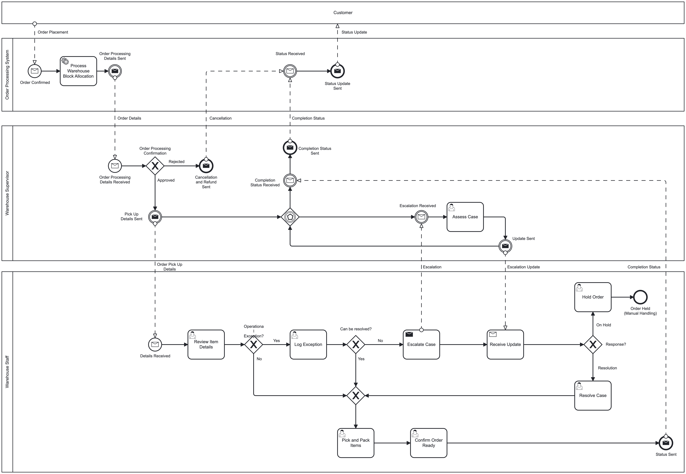
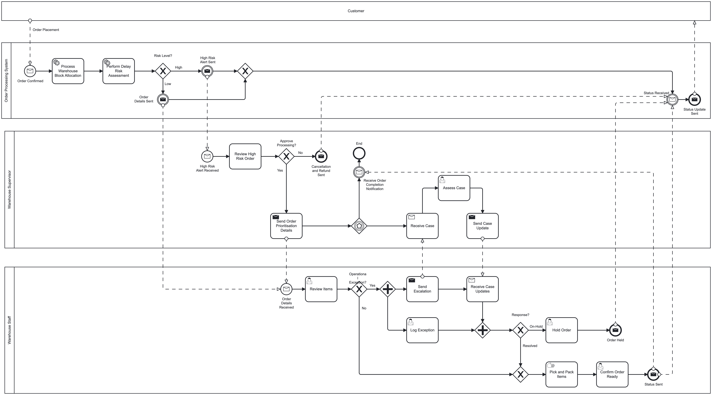
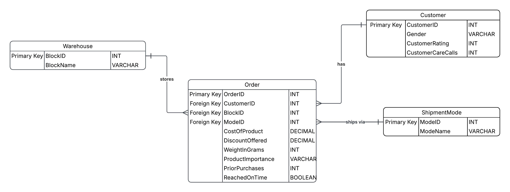
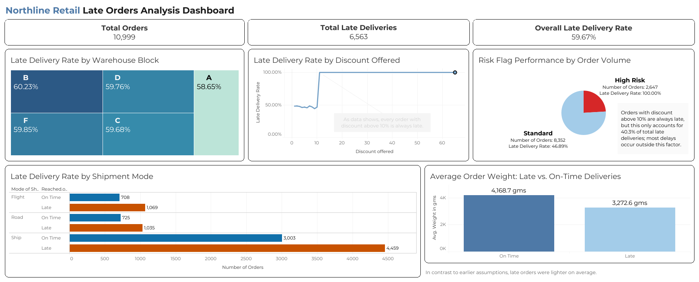

# Northline Retail: Order Fulfilment Delay Analysis

Northline Retail is a fictional e-commerce retailer used for this project. The dataset uses Kaggle's E-Commerce Shipping Data, roughly 11,000 historical orders, as a representation of Northline's operation to test whether delivery delay can be predicted and acted on before an order ships. This project combines business process analysis with data analysis: a business case, as-is and to-be BPMN diagrams, an ERD, SQL analysis, and a Power BI/Tableau dashboard.

## Business Case

Northline's current fulfilment process has no step that checks whether an order is likely to be late before it ships. Orders move through allocation, picking, and dispatch the same way regardless of weight, discount, or warehouse, and risk is only visible once a delivery has already failed to arrive on time.

Full write-up: [`business-case.md`](01-business-case/business-case.md)
User stories: [`user-stories.md`](01-business-case/user-stories.md)

## Process Models

The as-is diagram maps Northline's current order fulfilment process, including approval, fulfilment exception handling, and escalation. The to-be diagram adds one automated risk-flagging step after warehouse allocation, using the factors confirmed by the SQL analysis below, and narrows supervisor approval to orders that actually meet risk criteria instead of applying it to every order.

1. AS-IS BPMN:

2. TO-BE BPMN:

A simplified, happy-path version of the as-is process is included separately for a quicker overview: [`as-is-happy-path.png`](02-process-models/as-is-happy-path.png)

## Data Model

The data model consists of four tables: Orders, Customers, Warehouse, and ShipmentMode. Orders serves as the central table, with the remaining three referenced by foreign key. CustomerID is a constructed identifier rather than a field present in the source dataset, since no customer-level identifier exists in the raw data, each order is treated as a distinct customer for modelling purposes.

## SQL Analysis

This project includes six SQL questions, each tied to a specific claim made in the business case rather than open-ended exploration of the dataset:

1. What is the overall late delivery rate?
2. Are certain warehouses or shipping methods underperforming?
3. Are discounted orders putting delivery performance at risk?
4. Is order weight a factor worth accounting for?
5. Does a discount-based rule reliably predict late orders?
6. Does that rule hold consistently across every warehouse?

Full queries: [`queries.sql`](04-sql/queries.sql)

## Dashboard

The dashboard contains five visuals, each built directly from the SQL results above: overall late rate, late rate by warehouse block, late rate by discount offered, risk-flag reliability by order volume, and a weight comparison between late and on-time orders.

## Key Findings

Northline's overall late delivery rate is 59.67% across 10,999 orders. Warehouse block and shipment mode showed no meaningful effect on delay, with late rates staying within a 57 to 62 percent band across every combination tested. Every order with a discount above 10% was late, with no exceptions, while orders at 10% or below had a late rate close to the overall average. This discount rule is reliable but limited: it applies to only 24% of orders, so it accounts for around 40% of total late orders, leaving the remaining 60% unexplained by discount, weight, warehouse, or shipment mode. Late orders were also lighter on average than on-time orders, the opposite of the original hypothesis.

Full write-up, including limitations and next steps: [`findings-summary.md`](06-findings/findings-summary.md)

## Notes on Scope

This project uses a simple, rule-based risk flag rather than a trained model. The dataset does not include timestamps, so trend or seasonal analysis wasn't possible. The BPMN diagrams model system, supervisor, and staff as separate pools rather than lanes within one pool, a deliberate deviation from standard textbook convention, made because the process reflects direct coordination between roles rather than system-enabled handoffs.
